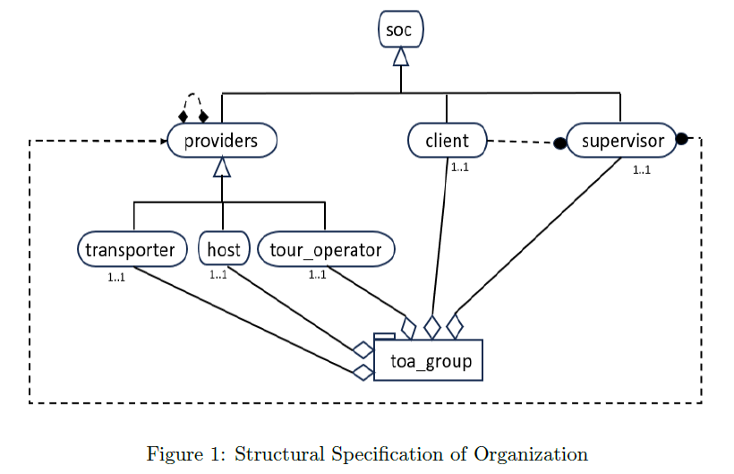
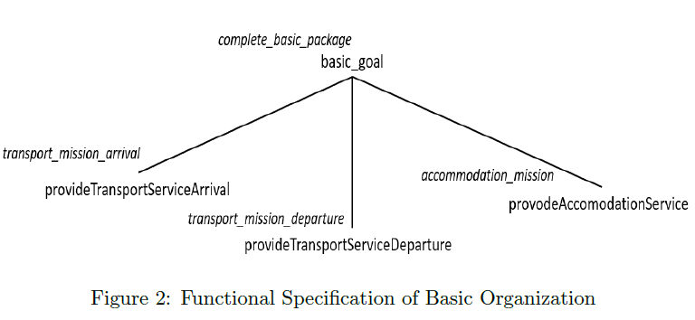
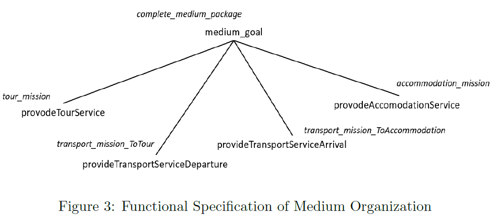

# Multi-Agent System for Holiday Package Coordination and Contracting
A holiday package (hp) combines services (accommodation, transport, tours, etc.) in one place, chosen by consumers. Consumers buy from tour operators, and services are provided in the package's defined order. The project was developed as part of the coursework for the Multi-Agent Coordination course, focusing on enhancing the efficiency of holiday package planning through the use of virtual agents.

## Project Overview

The project leverages a network of virtual agents representing various stakeholders in the tourism industry tour operators, service companies, and consumers. These agents interact through a multi-phase process to coordinate and execute holiday packages efficiently.

### Core Phases

1. **Phase 1: Contracting Phase**:
   - Service companies (SCAs) propose their services to tour operators (TOAs).
   - TOAs select SCAs based on their requirements, initiating an auction to finalize service contracts.
   - This phase emphasizes dynamic interactions and decision-making based on profit maximization.

2. **Phase 2: Purchasing Phase**:
   - TOAs compete to offer holiday packages to consumers through an auction mechanism.
   - Consumers select the best offer based on their location and preferences.
   - This phase integrates consumer choice into the planning process.

3. **Phase 3: Delivering Phase**:
   - Once contracts are established, the services are executed according to the chosen holiday package.
   - The phase is automated, with TOAs coordinating the services provided by SCAs and ensuring client satisfaction.

### Organization

The project focuses on creating holiday trip plans that cater to different traveler preferences. Below is a structural specification of the organization, providing a visual overview:

<p align="center">
    
</p>

#### Package
Three holiday packages have been conceptualized:

1. **Basic Package**: Offers essential travel services, including airport transfers and accommodation.

<p align="center">
    
</p>


2. **Medium Package**: Builds on the Basic Package by adding local tours to enhance the travel experience.

<p align="center">
    
</p>

3. **Premium Package**: A proposed luxury package that has not yet been fully implemented.

The Basic and Medium packages are fully operational and interact effectively with the developed agents. The Premium Package is planned for future implementation.


## Project Structure

- **Code and Development**: The core logic and interactions among agents are implemented across different phases in this section.
- **Organization**: Defines the structural and functional specifications for the different holiday packages.
- **Final Remarks**: Discusses potential improvements and future work for the project.

### Key Files

- `sca.asl`: Defines the behavior of Service Company Agents.
- `toa.asl`: Defines the behavior of Tour Operator Agents.
- `ca.asl`: Defines the behavior of Client Agents.
- `build.gradle`: Configuration file to build and run the project.


### Prerequisites

- [IntelliJ IDEA](https://www.jetbrains.com/idea/) or any other compatible IDE.
- Gradle installed on your system.

### Running the Code

1. **Clone the Repository**: Use the following command to clone the repository to your local machine:
   ```
   git clone https://github.com/TareqChy1/Multi-Agent-System-for-Holiday-Package-Coordination-and-Contracting.git
   ```
2. **Open the Project**: Load the `mac-project` in your IDE.
3. **Run the Project**:
   - Use the following Gradle command to build and run the project:
     ```
     ./gradlew -q --console=plain
     ```
   - This will automatically start the first two phases.

4. **Initiate the Third Phase**:
   - Use the REPL agent to start the third phase:
     ```
     .send(toa, achieve, go)
     ```


## Future Work

- **Auction Mechanism**: Enhance the auction system to support dynamic bidding.
- **Automate Phase 3**: Make the final phase execution fully automated.
- **Premium Package**: Implement and test the Premium holiday package.
- **Edge Case Handling**: Improve error handling and alternative solutions for failed scenarios.


